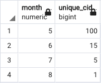

# Задание 1 (SQL)

Дан csv файл с историей заказов (client_id - торговая точка, purchase_date - дата закупки). Надо написать SQL запросы, чтобы посчитать для каждого месяца:
1. Новые торговые точки.
2. Торговые точки, сделавшие заказ в прошлом месяце и в этом.
3. Торговые точки, которые когда-то что-то заказали (только не в прошлом месяце) и вернувшиеся.
4. Торговые точки, отвалившиеся в этом месяце. 

Не обязательное задание:
положить этот csv файл в SQL базу данных

---
## Загрузка файла 
Запуск проходит на MacOS

1. Запускаем PostgreSQL 14.
2. Запусукаем pgAdmin 4.
3. Запускаем свой локальный сервер.
4. Создаем схему под названием public (как на картинке ниже).


5. Далее открываем схему и переходим в меню таблиц, и создаем новую таблицу (как на картинке ниже).


6. В открывшемся окне (во вкладке General) присваиваем новой таблице название orders.


7. И в разделе Columns создаем соответветствующие колонки как в нашем csv файле.


8. Теперь импортируем в нашу созданную таблицу odres уже готовый csv.


9. Не забываем указать наличие заголовка, а также выбрать разделитель (запятую).


10. Проверяем что всё загрузилось:

```sql
select *
from public.orders
```


Всё работает. Можно переходить к решению задачи.

---
## 1. Новые торговые точки 

Сперва посмотрим на состав данных:
- Найдем все месяцы и сгруппируем по ним все уникальные ID клиентов в рамках каждого месяца:

```sql
select EXTRACT(MONTH from purchase_date) as month, count(distinct(client_id)) as unique_clients
from public.orders
group by EXTRACT(MONTH from purchase_date)
```


Итак, у нас есть в распоряжении май, июнь, июль и август. Новые точки - это точки, которые появились только в этом месяце и, которых не было раньше. Для каждого месяца, таким образом, предыдущий месяц будет уникален. Для августа - июль, для июля - июнь, и т.д. 

```sql
(select EXTRACT(MONTH from purchase_date) as month, count(distinct(client_id)) as unique_cid
from public.orders
where EXTRACT(MONTH from purchase_date) = 5 and
	client_id not in (
	select distinct(client_id)
	from public.orders
	where EXTRACT(MONTH from purchase_date) = 4
	)
group by month)

union all

(select EXTRACT(MONTH from purchase_date) as month, count(distinct(client_id)) as unique_cid
from public.orders
where EXTRACT(MONTH from purchase_date) = 6 and
	client_id not in (
	select distinct(client_id)
	from public.orders
	where EXTRACT(MONTH from purchase_date) = 5
	)
group by month)

union all

(select EXTRACT(MONTH from purchase_date) as month, count(distinct(client_id)) as unique_cid
from public.orders
where EXTRACT(MONTH from purchase_date) = 7 and
	client_id not in (
	select distinct(client_id)
	from public.orders
	where EXTRACT(MONTH from purchase_date) = 6
	)
group by month)

union all 

(select EXTRACT(MONTH from purchase_date) as month, count(distinct(client_id)) as unique_cid
from public.orders
where EXTRACT(MONTH from purchase_date) = 8 and
	client_id not in (
	select distinct(client_id)
	from public.orders
	where EXTRACT(MONTH from purchase_date) = 7
	)
group by month)
```



Таким образом, за 5 месяц мы имеем 100 уникальных client_id, так как данные за 4-ый месяц отсутствуют. Далее, распределение новых точек выглядит более приземленно:
- с мая по июнь прибавилось 15 уникальных точек;
- с юиня по июль прибавилось 5 уникальных точек;
- с июля по август прибавилась лишь 1 уникальная точка, однако данные за август не полные.

---
## 2. Торговые точки, сделавшие заказ в прошлом месяце и в этом

```sql
(select EXTRACT(MONTH from purchase_date) as month, count(distinct(client_id)) as unique_cid
from public.orders
where EXTRACT(MONTH from purchase_date) = 5 and
	client_id in (
	select distinct(client_id)
	from public.orders
	where EXTRACT(MONTH from purchase_date) = 4
	)
group by month)

union all

(select EXTRACT(MONTH from purchase_date) as month, count(distinct(client_id)) as unique_cid
from public.orders
where EXTRACT(MONTH from purchase_date) = 6 and
	client_id in (
	select distinct(client_id)
	from public.orders
	where EXTRACT(MONTH from purchase_date) = 5
	)
group by month)

union all

(select EXTRACT(MONTH from purchase_date) as month, count(distinct(client_id)) as unique_cid
from public.orders
where EXTRACT(MONTH from purchase_date) = 7 and
	client_id in (
	select distinct(client_id)
	from public.orders
	where EXTRACT(MONTH from purchase_date) = 6
	)
group by month)

union all 

(select EXTRACT(MONTH from purchase_date) as month, count(distinct(client_id)) as unique_cid
from public.orders
where EXTRACT(MONTH from purchase_date) = 8 and
	client_id in (
	select distinct(client_id)
	from public.orders
	where EXTRACT(MONTH from purchase_date) = 7
	)
group by month)
```


По итогам запроса можно увидеть, что:
- торговыx точек, которые сделали заказ в июне и мае было 79;
- а торговых точек, которые сделали заказ в июле и июне стало уже 68. 

---
## 3. Торговые точки, которые когда-то что-то заказали (только не в прошлом месяце) и вернувшиеся.

```sql
(select EXTRACT(MONTH from purchase_date) as month, count(distinct(client_id)) as unique_cid
from public.orders
where EXTRACT(MONTH from purchase_date) = 5 and
	client_id in (
	select distinct(client_id)
	from public.orders
	where EXTRACT(MONTH from purchase_date) > 5
	)
group by month)

union all

(select EXTRACT(MONTH from purchase_date) as month, count(distinct(client_id)) as unique_cid
from public.orders
where EXTRACT(MONTH from purchase_date) = 6 and
	client_id in (
	select distinct(client_id)
	from public.orders
	where EXTRACT(MONTH from purchase_date) > 6
	)
group by month)

union all

(select EXTRACT(MONTH from purchase_date) as month, count(distinct(client_id)) as unique_cid
from public.orders
where EXTRACT(MONTH from purchase_date) = 7 and
	client_id in (
	select distinct(client_id)
	from public.orders
	where EXTRACT(MONTH from purchase_date) > 7
	)
group by month)

union all 

(select EXTRACT(MONTH from purchase_date) as month, count(distinct(client_id)) as unique_cid
from public.orders
where EXTRACT(MONTH from purchase_date) = 8 and
	client_id in (
	select distinct(client_id)
	from public.orders
	where EXTRACT(MONTH from purchase_date) > 8
	)
group by month)
```


Как видно из таблицы:
- Кол-во торговых точек, которые заказали в мае и вернулись в последующие месяцах составило 85.
- А кол-во торговых точек, которые заказали в июне и вернулись в последующих месяцах составило 68.

---
## 4. Торговые точки, отвалившиеся в этом месяце. 

```sql
(select EXTRACT(MONTH from purchase_date) as month, count(distinct(client_id)) as unique_cid
from public.orders
where EXTRACT(MONTH from purchase_date) = 5 and
	client_id not in (
	select distinct(client_id)
	from public.orders
	where EXTRACT(MONTH from purchase_date) = 6
	)
group by month)

union all

(select EXTRACT(MONTH from purchase_date) as month, count(distinct(client_id)) as unique_cid
from public.orders
where EXTRACT(MONTH from purchase_date) = 6 and
	client_id not in (
	select distinct(client_id)
	from public.orders
	where EXTRACT(MONTH from purchase_date) = 7
	)
group by month)

union all

(select EXTRACT(MONTH from purchase_date) as month, count(distinct(client_id)) as unique_cid
from public.orders
where EXTRACT(MONTH from purchase_date) = 7 and
	client_id not in (
	select distinct(client_id)
	from public.orders
	where EXTRACT(MONTH from purchase_date) = 8
	)
group by month)
```


Таким образом мы получаем, что:
- с мая по июнь отвалилось 25 торговых точек;
- с июня по июль отвалилось 26 торговых точек;
- с июля по август отвалилось 73 торговых точки.
